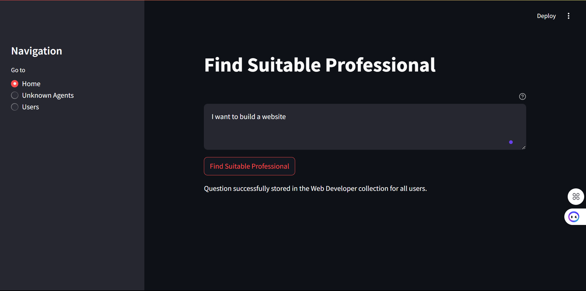
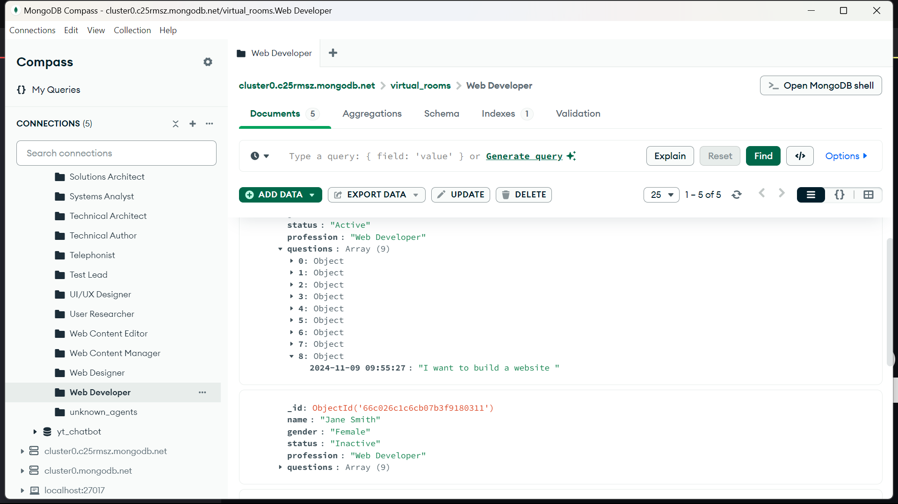
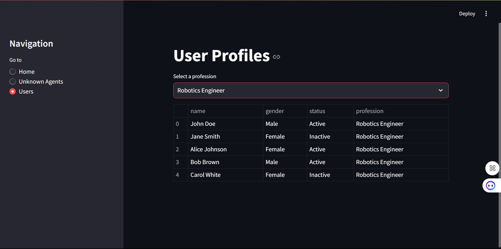

# Professional Query Router System

## Query

## Database

## Datbase Structure

## Virtual Room User

## Overview

The Professional Query Router System is an intelligent platform that connects users with the most suitable professionals based on their queries. The system uses AI to analyze questions and route them to the appropriate professional groups.

## How It Works

1. **Query Input**
   - Users enter their questions or problems through a clean, intuitive interface
   - The system accepts any type of query related to professional services

2. **AI Agent Analysis**
   - GPT-3.5 analyzes the query content
   - Determines the most appropriate professional category
   - Suggests the best-suited profession to handle the query

3. **Professional Routing**
   - System checks for matching professional groups in the database
   - If found, routes the query to all professionals in that category
   - If no matching group exists, stores the query in an "Unknown Agents" collection for future handling

## Features

- **Smart Profession Matching**: AI-powered analysis to determine the most suitable profession
- **Real-time Routing**: Instant delivery of queries to relevant professional groups
- **Unknown Agent Handling**: Storage system for queries without matching professional groups
- **User Management**: Professional group management and query tracking
- **Timezone Support**: Built-in timezone handling for accurate query timing

## Technical Implementation

- Built with Streamlit for the frontend interface
- MongoDB for database management
- OpenAI's GPT-3.5 for query analysis
- Supports multiple professional categories
- Real-time query distribution system

## Collections Structure

- Individual collections for each profession
- Special 'unknown_agents' collection for unmatched queries
- Each query stored with timestamp and relevant metadata

## Usage

1. Navigate to the home page
2. Enter your query in the text area
3. Click "Find Suitable Professional"
4. System will automatically:
   - Analyze your query
   - Match it with the appropriate profession
   - Route it to relevant professionals
   - Provide feedback on the routing status

## Navigation

- **Home**: Main query input interface
- **Unknown Agents**: View queries without matching professionals
- **Users**: Browse professional categories and their members 